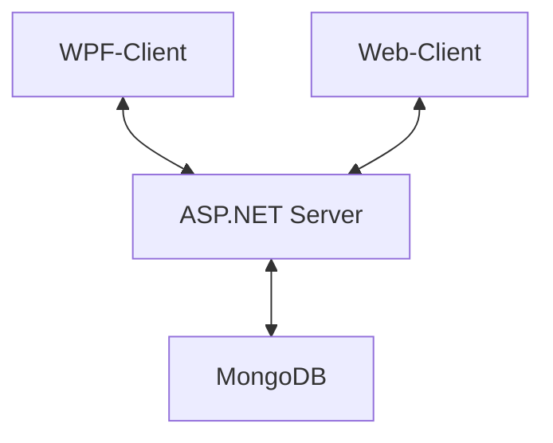

# Dokumentation Semesterprojekt Beierschoder

## Softwaredesign (Architektur)

Die ChatApp "SuperChat" wurde anhand einer Client-Server-Architektur entwickelt. Dabei handelt es sich um einen WPF-Client, sowie Web-Client, welche beide über einen Server (ASP.NET Applikation) kommunizieren. Die daraus entstehenden Daten werden in einer MongoDB-Datenbank gespeichert.



## Beschreibung der Software

Die ChatApp "SuperChat" ermöglicht es verschiedensten Benutzern miteinander zu chatten. Dabei legt jeder Benutzer zunächst seinen "User" an, mit dem er sich daraufhin immer wieder anmelden kann. Ein "User" kann dabei mehrere "Chats" mit anderen "Usern" haben. Die Benutzeroberfläche ist einerseits eine WPF-Anwendung, welche die gleichen Funktionalitäten besitzen wie die dazugehörige Web-Anwendung. Beide Anwendungen bieten eine benutzerfreundliche Oberfläche.

## WPF-Anwendung

### Login/Register
<br>

Die Login-Seite der WPF-Anwendung wird anhand zweier Eingabefelder dargestellt<br>
Im "Benutzername"-Feld gibt der Benutzer seinen gewünschten Benutzernamen ein, sofern dieser noch nicht vergeben ist/ es noch keinen "User" mit dem gleichen Benutzernamen gibt. Daraufhin muss der Benutzer noch ein Passwort eingeben.<br>
Wenn beide Kriterien erfüllt sind, kann sich der Benutzer entweder registrieren oder anmelden (wenn bereits registriert).<br>
Durch das Bestätigen des PopUp-Fensters, gelangt der Benutzer nun auf die "Homepage" der WPF-Anwendung.

### Homepage
Die Homepage ist das Herzstück der ChatApp. Es besteht grundsätzlich aus 5 Komponenten, welche im Kommenden näher beschrieben werden.
<br>
#### Searchbar
Die Searchbar befindet sich ganz links und soll den Benutzer durch "Search for new Users" auffordern, neue Benutzer im System zu durchsuchen.<br>
Sucht der Benutzer nun bspw. nach einem gewissen Namen und beginnt zu schreiben, werden ihm im Schreibprozess bereits alle User angezeigt, welche mit den jeweiligen Buchstaben beginnen.<br>
Hat der Benutzer nun seinen gewünschten Chatpartner gefunden, klickt er ihn ganz einfach an und es wird ein Chat erstellt.<br>
#### LstChats
Wenn ein User in der Searchbar angeklickt wird, erscheint er in "LstChats". Hier werden anhand einer Liste alle User ausgegeben, mit denen der angemeldete Benutzer einen existierenden Chat hat.<br>
Dadurch muss der Benutzer nicht jedes mal den gewünschten Chatpartner suchen, sondern kann ganz einfach die LstChats-Methode verwenden.<br>
Klickt der Benutzer nun auf einen User in lstChats, wird der dazugehörige Chat-(verlauf) in LstChat angezeigt.<br>
#### LstChat
LstChat ist grundsätzlich die Liste des Chatverlaufs, zwischen den zwei Usern. Es wird das jeweilige Datum / die Uhrzeit der Nachricht angezeigt. Zudem kann der angemeldete Benutzer seine Nachrichten auch wieder löschen, indem er die "Entf"-Taste auf der Tastatur drückt.<br>
#### Benutzerfeld
Oben rechts wird das klassisches User-Logo angezeigt. Klickt man darauf, wird einem der aktuell angemeldete Benutzername angezeigt, sowie die Optionen, den User wieder auszuloggen (und damit zurück zum Login-Fenster zu gelangen) oder seinen User zu löschen.<br>
#### Link
In der Fußzeile der ChatApp kann man durch einen Klick auf den blau hinterlegten Link "GitHub" zur öffentlichen GitHub-Seite dieses ChatApp-Projekts gelangen.<br>

## Web-Anwendung

### Login/Register
<br>

Die Login-Seite der WPF-Anwendung wird anhand zweier Eingabefelder dargestellt<br>
Im "Benutzername"-Feld gibt der Benutzer seinen gewünschten Benutzernamen ein, sofern dieser noch nicht vergeben ist/ es noch keinen "User" mit dem gleichen Benutzernamen gibt. Daraufhin muss der Benutzer noch ein Passwort eingeben.<br>
Wenn beide Kriterien erfüllt sind, kann sich der Benutzer entweder registrieren oder anmelden (wenn bereits registriert).<br>
Durch das Bestätigen des PopUp-Fensters, gelangt der Benutzer nun auf die "Homepage" der WPF-Anwendung.

### Homepage
Die Homepage ist das Herzstück der ChatApp. Es besteht grundsätzlich aus 5 Komponenten, welche im Kommenden näher beschrieben werden.
<br>
#### Searchbar
Die Searchbar befindet sich ganz links und soll den Benutzer durch "Search for new Users" auffordern, neue Benutzer im System zu durchsuchen.<br>
Sucht der Benutzer nun bspw. nach einem gewissen Namen und beginnt zu schreiben, werden ihm im Schreibprozess bereits alle User angezeigt, welche mit den jeweiligen Buchstaben beginnen.<br>
Hat der Benutzer nun seinen gewünschten Chatpartner gefunden, klickt er ihn ganz einfach an und es wird ein Chat erstellt.<br>
#### LstChats
Wenn ein User in der Searchbar angeklickt wird, erscheint er in "LstChats". Hier werden anhand einer Liste alle User ausgegeben, mit denen der angemeldete Benutzer einen existierenden Chat hat.<br>
Dadurch muss der Benutzer nicht jedes mal den gewünschten Chatpartner suchen, sondern kann ganz einfach die LstChats-Methode verwenden.<br>
Klickt der Benutzer nun auf einen User in lstChats, wird der dazugehörige Chat-(verlauf) in LstChat angezeigt.<br>
#### LstChat
LstChat ist grundsätzlich die Liste des Chatverlaufs, zwischen den zwei Usern. Es wird das jeweilige Datum / die Uhrzeit der Nachricht angezeigt. Zudem kann der angemeldete Benutzer seine Nachrichten auch wieder löschen, indem er über die gewünschte Nachricht hovert, und auf das Papierkorb-Icon klickt.<br>
#### Benutzerfeld
Oben rechts wird das klassisches User-Logo angezeigt. Klickt man darauf, wird einem der aktuell angemeldete Benutzername angezeigt, sowie die Optionen, den User wieder auszuloggen (und damit zurück zum Login-Fenster zu gelangen) oder seinen User zu löschen.<br>
#### Link
In der Fußzeile der ChatApp kann man durch einen Klick auf den blau hinterlegten Link "GitHub" zur öffentlichen GitHub-Seite dieses ChatApp-Projekts gelangen.<br>

##  API-Beschreibung
Der Server basiert auf ASP.NET und stellt den Clients verschiedenste Endpoints zur Verfügung:


### Die Endpunkte umfassen:


## Benutzer
<details>
  <summary>/api/User [GET]</summary>
  
  **Beschreibung:** Dieser Endpunkt wird verwendet, um einen Benutzer basierend auf Benutzername und Passwort abzurufen.
  
  **Query-Parameter:**
username: string
password: string
**Return-Wert:**
```json
{
  "id": "Beispiel-UserID",
  "username": "Beispiel-Benutzername",
  "password": "Beispiel-Passwort",
  // Weitere Felder...
}
```
</details>
<details>
  <summary>/api/User/{id} [GET]</summary>
Beschreibung: Dieser Endpunkt wird verwendet, um einen Benutzer basierend auf seiner ID abzurufen.

URL-Parameter:
id: string

Return-Wert:
{
  "id": "Beispiel-UserID",
  "username": "Beispiel-Benutzername",
  // Weitere Felder...
}

</details>
<details>
  <summary>/api/User [POST]</summary>
Beschreibung: Dieser Endpoint wird verwendet, um einen neuen Benutzer anzulegen.

JSON-Body:
{
  "username": "Beispiel-Benutzername",
  "password": "Beispiel-Passwort"
}

Return-Wert:
{
  "id": "Beispiel-UserID",
  "username": "Beispiel-Benutzername",
}

</details>
<details>
  <summary>/api/User/Login [POST]</summary>
Beschreibung: Dieser Endpoint wird verwendet, um einen Benutzer einzuloggen.

JSON-Body:
{
  "username": "Beispiel-Benutzername",
  "password": "Beispiel-Passwort"
}
Return-Wert:
{
  "id": "Beispiel-UserID",
  "username": "Beispiel-Benutzername",
  // Weitere Felder...
}
</details>
<details>
  <summary>/api/User/Search [GET]</summary>
Beschreibung: Dieser Endpoint wird verwendet, um Benutzer basierend auf einer Suchanfrage zu finden.

Query-Parameter:
