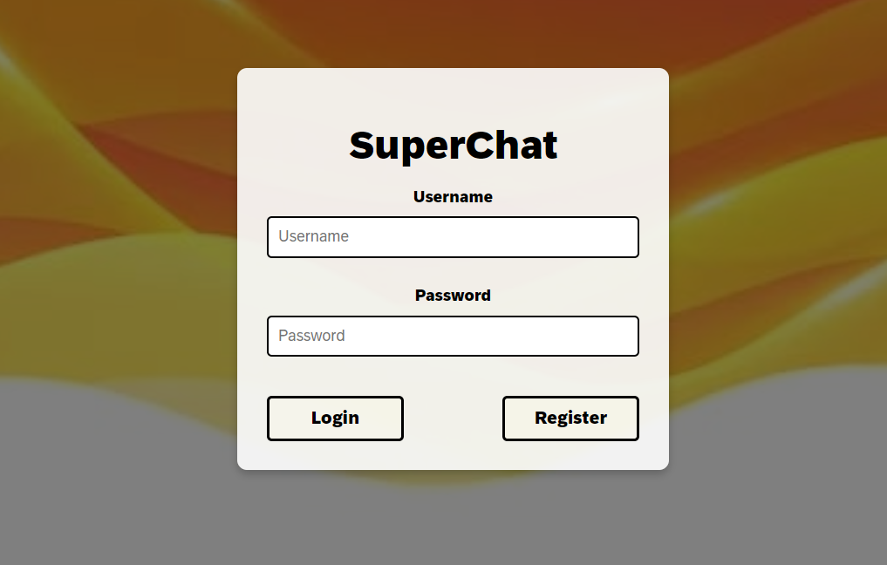

# Dokumentation Semesterprojekt Beierschoder

## Softwaredesign (Architektur)

Die ChatApp "SuperChat" wurde anhand einer Client-Server-Architektur entwickelt. Dabei handelt es sich um einen WPF-Client, sowie Web-Client, welche beide über einen Server (ASP.NET Applikation) kommunizieren. Die daraus entstehenden Daten werden in einer MongoDB-Datenbank gespeichert.


## Beschreibung der Software

Die ChatApp "SuperChat" ermöglicht es verschiedensten Benutzern miteinander zu chatten. Dabei legt jeder Benutzer zunächst seinen "User" an, mit dem er sich daraufhin immer wieder anmelden kann. Ein "User" kann dabei mehrere "Chats" mit anderen "Usern" haben. Die Benutzeroberfläche ist einerseits eine WPF-Anwendung, welche die gleichen Funktionalitäten besitzen wie die dazugehörige Web-Anwendung. Beide Anwendungen bieten eine benutzerfreundliche Oberfläche.

## WPF-Anwendung
<br>

### Login/Register
<br>

Die Login-Seite der WPF-Anwendung wird anhand zweier Eingabefelder dargestellt<br>
Im "Benutzername"-Feld gibt der Benutzer seinen gewünschten Benutzernamen ein, sofern dieser noch nicht vergeben ist/ es noch keinen "User" mit dem gleichen Benutzernamen gibt. Daraufhin muss der Benutzer noch ein Passwort eingeben.<br>
Wenn beide Kriterien erfüllt sind, kann sich der Benutzer entweder registrieren oder anmelden (wenn bereits registriert).<br>
Durch das Bestätigen des PopUp-Fensters, gelangt der Benutzer nun auf die "Homepage" der WPF-Anwendung.

### Homepage
<br>

Die Homepage ist das Herzstück der ChatApp. Es besteht grundsätzlich aus 5 Komponenten, welche im Kommenden näher beschrieben werden.

#### Searchbar
<br>

Die Searchbar befindet sich ganz links und soll den Benutzer durch "Search for new Users" auffordern, neue Benutzer im System zu durchsuchen.<br>
Sucht der Benutzer nun bspw. nach einem gewissen Namen und beginnt zu schreiben, werden ihm im Schreibprozess bereits alle User angezeigt, welche mit den jeweiligen Buchstaben beginnen.<br>
Hat der Benutzer nun seinen gewünschten Chatpartner gefunden, klickt er ihn ganz einfach an und es wird ein Chat erstellt.<br>

#### LstChats
<br>

Wenn ein User in der Searchbar angeklickt wird, erscheint er in "LstChats". Hier werden anhand einer Liste alle User ausgegeben, mit denen der angemeldete Benutzer einen existierenden Chat hat.<br>
Dadurch muss der Benutzer nicht jedes mal den gewünschten Chatpartner suchen, sondern kann ganz einfach die LstChats-Methode verwenden.<br>
Klickt der Benutzer nun auf einen User in lstChats, wird der dazugehörige Chat-(verlauf) in LstChat angezeigt.<br>

#### LstChat
<br>

LstChat ist grundsätzlich die Liste des Chatverlaufs, zwischen den zwei Usern. Es wird das jeweilige Datum / die Uhrzeit der Nachricht angezeigt. Zudem kann der angemeldete Benutzer seine Nachrichten auch wieder löschen, indem er die "Entf"-Taste auf der Tastatur drückt.<br>

#### Benutzerfeld
<br>

Oben rechts wird das klassisches User-Logo angezeigt. Klickt man darauf, wird einem der aktuell angemeldete Benutzername angezeigt, sowie die Optionen, den User wieder auszuloggen (und damit zurück zum Login-Fenster zu gelangen) oder seinen User zu löschen.<br>

#### Link
<br>

In der Fußzeile der ChatApp kann man durch einen Klick auf den blau hinterlegten Link "GitHub" zur öffentlichen GitHub-Seite dieses ChatApp-Projekts gelangen.<br>

## Web-Anwendung

### Login/Register
<br>

Die Login-Seite der WPF-Anwendung wird anhand zweier Eingabefelder dargestellt<br>
Im "Benutzername"-Feld gibt der Benutzer seinen gewünschten Benutzernamen ein, sofern dieser noch nicht vergeben ist/ es noch keinen "User" mit dem gleichen Benutzernamen gibt. Daraufhin muss der Benutzer noch ein Passwort eingeben.<br>
Wenn beide Kriterien erfüllt sind, kann sich der Benutzer entweder registrieren oder anmelden (wenn bereits registriert).<br>
Durch das Bestätigen des PopUp-Fensters, gelangt der Benutzer nun auf die "Homepage" der WPF-Anwendung.

### Homepage
<br>

Die Homepage ist das Herzstück der ChatApp. Es besteht grundsätzlich aus 5 Komponenten, welche im Kommenden näher beschrieben werden.

#### Searchbar
<br>

Die Searchbar befindet sich ganz links und soll den Benutzer durch "Search for new Users" auffordern, neue Benutzer im System zu durchsuchen.<br>
Sucht der Benutzer nun bspw. nach einem gewissen Namen und beginnt zu schreiben, werden ihm im Schreibprozess bereits alle User angezeigt, welche mit den jeweiligen Buchstaben beginnen.<br>
Hat der Benutzer nun seinen gewünschten Chatpartner gefunden, klickt er ihn ganz einfach an und es wird ein Chat erstellt.<br>
#### LstChats
<br>

Wenn ein User in der Searchbar angeklickt wird, erscheint er in "LstChats". Hier werden anhand einer Liste alle User ausgegeben, mit denen der angemeldete Benutzer einen existierenden Chat hat.<br>
Dadurch muss der Benutzer nicht jedes mal den gewünschten Chatpartner suchen, sondern kann ganz einfach die LstChats-Methode verwenden.<br>
Klickt der Benutzer nun auf einen User in lstChats, wird der dazugehörige Chat-(verlauf) in LstChat angezeigt.<br>
#### LstChat
<br>

LstChat ist grundsätzlich die Liste des Chatverlaufs, zwischen den zwei Usern. Es wird das jeweilige Datum / die Uhrzeit der Nachricht angezeigt. Zudem kann der angemeldete Benutzer seine Nachrichten auch wieder löschen, indem er über die gewünschte Nachricht hovert, und auf das Papierkorb-Icon klickt.<br>
#### Benutzerfeld
Oben rechts wird das klassisches User-Logo angezeigt. Klickt man darauf, wird einem der aktuell angemeldete Benutzername angezeigt, sowie die Optionen, den User wieder auszuloggen (und damit zurück zum Login-Fenster zu gelangen) oder seinen User zu löschen.<br>
#### Link
<br>

In der Fußzeile der ChatApp kann man durch einen Klick auf den blau hinterlegten Link "GitHub" zur öffentlichen GitHub-Seite dieses ChatApp-Projekts gelangen.<br>

Im Prinzip ist der Aufbau von WPF- und Webanwendung genau gleich. Die einzelnen Komponenten waren logischerweise in der Webanwendung viel einfacher umzusetzen. Trotzdem habe ich mit der WPF-Anwendung begonnen, weshalb die nachfolgende Umsetzung in Webform simpler war.

##  API-Beschreibung
Der Server basiert auf ASP.NET und stellt den Clients verschiedenste Endpoints zur Verfügung:


### Die Endpunkte umfassen:


## User
<details>
  <summary>/api/User [GET]</summary>
  
  **Beschreibung:** Dieser Endpunkt wird verwendet, um einen Benutzer basierend auf Benutzername und Passwort abzurufen.
  
  **Query-Parameter:**
```json
  {
    "username": "Beispiel-Benutzername",
    "password": "Beispiel-Passwort"
  }
```
**Return-Wert:**
```json
{
  "id": "Beispiel-UserID",
  "username": "Beispiel-Benutzername",
  "password": "Beispiel-Passwort"
}
```
</details>


<details>
  <summary>/api/User/{id} [GET]</summary>
Beschreibung: Dieser Endpunkt wird verwendet, um einen Benutzer basierend auf seiner ID abzurufen.

  **URL-Parameter:**
```json
{
  "id": "Beispiel-ID"
}
```
**Return-Wert:**
```json
{
  "id": "Beispiel-ID",
  "username": "Beispiel-Benutzername",
  "password": "Beispiel-Passwort"
}
```
</details>


<details>
  <summary>/api/User/Search [GET]</summary>
Beschreibung: Dieser Endpunkt wird verwendet, um Benutzer basierend auf einer Suchanfrage zu finden.
  
**Query-Parameter:**
```json
{
  "query": "Beispiel-Suchanfrage"
}
```
**Return-Wert:**
```json
[
  {
    "id": "Beispiel-ID",
    "username": "Beispiel-Benutzername",
    "password": "Beispiel-Passwort"
  }
]
```
</details>


<details>
  <summary>/api/User [POST]</summary>
Beschreibung: Dieser Endpunkt wird verwendet, um einen neuen Benutzer anzulegen.

  **JSON-Body:**
```json
{
  "id": "Beispiel-ID",
  "username": "Beispiel-Benutzername",
  "password": "Beispiel-Passwort"
}
```

**Return-Wert:**
```json
{
  "id": "Beispiel-ID",
  "username": "Beispiel-Benutzername",
  "password": "Beispiel-Passwort"
}
```
</details>


<details>
  <summary>/api/User/Login [POST]</summary>
Beschreibung: Dieser Endpunkt wird verwendet, um einen Benutzer einzuloggen.

  **JSON-Body:**
```json
  {
    "id": "Beispiel-ID",
    "username": "Beispiel-Benutzername",
    "password": "Beispiel-Passwort"
  }
```

**Return-Wert:**
```json
  {
    "id": "Beispiel-ID",
    "username": "Beispiel-Benutzername",
    "password": "Beispiel-Passwort"
  }
```
</details>


<details>
  <summary>/api/User/{username} [DELETE]</summary>
Beschreibung: Dieser Endpunkt wird verwendet, um einen Benutzer zu löschen.

  **URL-Parameter:**
  ```json
  {
    "username": "Beispiel-Benutzername"
  }
  ```

**Return-Wert:**
  ```json
  {
      "message": "UserDeleted"
  }
  ```
</details>


## Message

<details>
  <summary>/api/Message [GET]</summary>
  
  **Beschreibung:** Dieser Endpunkt wird verwendet, um alle Nachrichten abzurufen.
  
  **Return-Wert:**
  ```json
  [
    {
      "id": "Beispiel-ID",
      "text": "Beispiel-Nachricht",
      "author": "Beispiel-Sender",
      "timeStamp": "2023-06-01T12:00:00Z"
    }
  ]
  ```
</details>


<details>
  <summary>/api/Message/{id} [GET]</summary>
  
  **Beschreibung:** Dieser Endpunkt wird verwendet, um eine Nachricht basierend auf ihrer ID abzurufen.

  **URL-Parameter:**
  ```json
  {
    "id": "Beispiel-ID"
  }
  ```

**Return-Wert:**
```json
{
  "id": "Beispiel-ID",
  "text": "Beispiel-Nachricht",
  "author": "Beispiel-Sender",
  "timeStamp": "2023-06-01T12:00:00Z"
}
```
</details>

<details>
  <summary>/api/Message [POST]</summary>
  
**Beschreibung:** Dieser Endpunkt wird verwendet, um eine neue Nachricht zu erstellen.

**JSON-Body:**
```json
{
  "text": "Beispiel-Nachricht",
  "author": "Beispiel-Sender",
  "timeStamp": "2023-06-01T12:00:00Z"
}

```

**Return-Wert:**
```json
{
  "id": "Beispiel-ID",
  "text": "Beispiel-Nachricht",
  "author": "Beispiel-Sender",
  "timeStamp": "2023-06-01T12:00:00Z"
}
```
</details>

<details>
  <summary>/api/Message/{id} [PUT]</summary>
  
**Beschreibung:** Dieser Endpunkt wird verwendet, um eine Nachricht basierend auf ihrer ID zu aktualisieren.

**URL-Parameter:**
```json
{
  "id": "Beispiel-ID"
}
```
**JSON-Body:**
```json
{
  "text": "Beispiel-Nachricht",
  "author": "Beispiel-Sender",
  "timeStamp": "2023-06-01T12:00:00Z"
}
```

**Return-Wert:** Kein Inhalt (204 No Content)

</details>

<details>
  <summary>/api/Message/{id} [DELETE]</summary>
  
**Beschreibung:** Dieser Endpunkt wird verwendet, um eine Nachricht basierend auf ihrer ID zu löschen.

**URL-Parameter:**
```json
{
    "id": "Beispiel-ID"
}
```
**Return-Wert:** Kein Inhalt (204 No Content)

</details>


## Chat

<details>
  <summary>/api/Chat [GET]</summary>
  
  **Beschreibung:** Dieser Endpunkt wird verwendet, um alle Chats abzurufen.
  
  **Return-Wert:**
  ```json
  [
    {
      "id": "Beispiel-ID",
      "participants": ["Benutzer1", "Benutzer2"],
      "messages": [
        {
          "id": "Beispiel-Nachrichten-ID",
          "text": "Beispiel-Nachricht",
          "author": "Beispiel-Sender",
          "timeStamp": "2023-06-01T12:00:00Z"
        }
      ]
    }
  ]
```
</details>

<details>
  <summary>/api/Chat/User/{username} [GET]</summary>
  
**Beschreibung:** Dieser Endpunkt wird verwendet, um alle Chats eines Benutzers abzurufen.

**URL-Parameter:**
  ```json
{
  "username": "Beispiel-Benutzername"
}
```

**Return-Wert:**
```json
[
  {
    "id": "Beispiel-ID",
    "participants": ["Benutzer1", "Benutzer2"],
    "messages": [
      {
        "id": "Beispiel-Nachrichten-ID",
        "text": "Beispiel-Nachricht",
        "author": "Beispiel-Sender",
        "timeStamp": "2023-06-01T12:00:00Z"
      }
    ]
  }
]
```
</details>

<details>
  <summary>/api/Chat/History/{username1}/{username2} [GET]</summary>
  
**Beschreibung:** Dieser Endpunkt wird verwendet, um den Chat-Verlauf zwischen zwei Benutzern abzurufen.

**URL-Parameter:**
```json
{
  "username1": "Benutzer1",
  "username2": "Benutzer2"
}
```

**Return-Wert:**
```json
[
  {
    "id": "Beispiel-Nachrichten-ID",
    "text": "Beispiel-Nachricht",
    "author": "Beispiel-Sender",
    "timeStamp": "2023-06-01T12:00:00Z"
  }
]
```
</details>

<details>
  <summary>/api/Chat/Participants/{userId1}/{userId2} [GET]</summary>
  
**Beschreibung:** Dieser Endpunkt wird verwendet, um einen Chat mit den angegebenen Teilnehmern abzurufen.

**URL-Parameter:**
```json
{
  "userId1": "Benutzer1-ID",
  "userId2": "Benutzer2-ID"
}
```

**Return-Wert:**
```json
{
  "id": "Beispiel-ID",
  "participants": ["Benutzer1", "Benutzer2"],
  "messages": [
    {
      "id": "Beispiel-Nachrichten-ID",
      "text": "Beispiel-Nachricht",
      "author": "Beispiel-Sender",
      "timeStamp": "2023-06-01T12:00:00Z"
    }
  ]
}
```
</details>

<details>
  <summary>/api/Chat [POST]</summary>
  
**Beschreibung:** Dieser Endpunkt wird verwendet, um einen neuen Chat zu erstellen.

**JSON-Body:**
```json
{
  "participants": ["Benutzer1", "Benutzer2"],
  "messages": []
}
```

**Return-Wert:**
```json
{
  "id": "Beispiel-ID",
  "participants": ["Benutzer1", "Benutzer2"],
  "messages": []
}
```
</details>

<details>
  <summary>/api/Chat/{id} [PUT]</summary>
  
**Beschreibung:** Dieser Endpunkt wird verwendet, um einen bestehenden Chat zu aktualisieren.

**URL-Parameter:**
```json
{
  "id": "Beispiel-ID"
}
```

**JSON-Body:**
```json
{
  "participants": ["Benutzer1", "Benutzer2"],
  "messages": [
    {
      "id": "Beispiel-Nachrichten-ID",
      "text": "Beispiel-Nachricht",
      "author": "Beispiel-Sender",
      "timeStamp": "2023-06-01T12:00:00Z"
    }
  ]
}
```
**Return-Wert:** Kein Inhalt (204 No Content)

</details>

<details>
  <summary>/api/Chat/{chatId}/Messages/{messageId} [DELETE]</summary>
  
**Beschreibung:** Dieser Endpunkt wird verwendet, um eine Nachricht aus einem Chat zu löschen.

**URL-Parameter:**
```json
{
  "chatId": "Beispiel-Chat-ID",
  "messageId": "Beispiel-Nachrichten-ID"
}
```

**Return-Wert:** Kein Inhalt (204 No Content)

</details>

## Verwendung der API

Die API wurde in Visual Studio 2022 anhand einer ASP.NET Applikation umgesetzt und heißt in meinem Projekt "MessageAPI". Diese besitzt für die Komponenten **Chat/Message/User** jeweils einen Controller sowie Service. Die Verbindung zur MongoDB Datenbank findet auch am Server statt.

### Chat

<details>
    <summary>ChatController</summary>
  
```csharp
using MessageAPI.Models;
using MessageAPI.Services;
using Microsoft.AspNetCore.Mvc;
using MongoDB.Bson;
using System;
using System.Collections.Generic;
using System.Threading.Tasks;

namespace MessageAPI.Controllers
{
    [ApiController]
    [Route("api/[controller]")]
    public class ChatController : ControllerBase
    {
        private readonly ChatService _chatService;

        public ChatController(ChatService chatService)
        {
            _chatService = chatService ?? throw new ArgumentNullException(nameof(chatService));
        }

        [HttpGet]
        public async Task<ActionResult<List<Chat>>> GetChats()
        {
            try
            {
                var chats = await _chatService.GetAsync();
                return Ok(chats);
            }
            catch (Exception ex)
            {
                return StatusCode(500, $"Internal server error: {ex.Message}");
            }
        }

        [HttpGet("User/{username}")]
        public async Task<ActionResult<List<Chat>>> GetChatsForUser(string username)
        {
            try
            {
                var chats = await _chatService.GetChatsForUser(username);
                return Ok(chats);
            }
            catch (Exception ex)
            {
                return StatusCode(500, $"Internal server error: {ex.Message}");
            }
        }

        [HttpGet("History/{username1}/{username2}")]
        public async Task<ActionResult<List<Message>>> GetChatHistory(string username1, string username2)
        {
            try
            {
                var chatHistory = await _chatService.GetChatHistoryAsync(username1, username2);
                return Ok(chatHistory);
            }
            catch (Exception ex)
            {
                return StatusCode(500, $"Internal server error: {ex.Message}");
            }
        }

        [HttpGet("Participants/{userId1}/{userId2}")]
        public async Task<ActionResult<Chat>> GetChatWithParticipants(string userId1, string userId2)
        {
            try
            {
                var chat = await _chatService.GetChatWithParticipantsAsync(userId1, userId2);
                if (chat == null)
                {
                    return NotFound();
                }
                return Ok(chat);
            }
            catch (Exception ex)
            {
                return StatusCode(500, $"Internal server error: {ex.Message}");
            }
        }

        [HttpPost]
        public async Task<IActionResult> CreateChat(Chat chat)
        {
            try
            {
                await _chatService.CreateAsync(chat);
                return CreatedAtRoute("GetChat", new { id = chat.Id }, chat);
            }
            catch (Exception ex)
            {
                return StatusCode(500, $"Internal server error: {ex.Message}");
            }
        }

        [HttpPut("{id:length(24)}")]
        public async Task<IActionResult> UpdateChat(string id, Chat chatIn)
        {
            if (!ObjectId.TryParse(id, out var objectId))
            {
                return BadRequest("Invalid chat ID format");
            }

            var chat = await _chatService.GetAsync(id);
            if (chat == null)
            {
                return NotFound();
            }

            chatIn.Id = id;

            try
            {
                await _chatService.UpdateChatAsync(id, chatIn);
                return NoContent();
            }
            catch (Exception ex)
            {
                return StatusCode(500, $"Internal server error: {ex.Message}");
            }
        }

        [HttpDelete("{chatId:length(24)}/Messages/{messageId:length(24)}")]
        public async Task<IActionResult> DeleteMessage(string chatId, string messageId)
        {
            try
            {
                var result = await _chatService.DeleteMessageAsync(chatId, messageId);
                if (result)
                {
                    return NoContent();
                }
                return NotFound("Message or Chat not found.");
            }
            catch (Exception ex)
            {
                return StatusCode(500, $"Internal server error: {ex.Message}");
            }
        }
    }
}

  ```
      
</details>

<details>
    <summary>ChatService</summary>
  
```csharp
using MongoDB.Driver;
using MessageAPI.Models;
using System;
using System.Collections.Generic;
using System.Threading.Tasks;
using Microsoft.Extensions.Options;
using MongoDB.Bson;
using System.Net.Http;
using System.Linq.Expressions;

namespace MessageAPI.Services
{
    public class ChatService
    {
        private readonly IMongoCollection<Chat> _chatsCollection;

        public ChatService(
            IOptions<MessageDatabaseSettings> messageDatabaseSettings)
        {
            var mongoClient = new MongoClient(
                messageDatabaseSettings.Value.ConnectionString);

            var mongoDatabase = mongoClient.GetDatabase(
                messageDatabaseSettings.Value.DatabaseName);

            _chatsCollection = mongoDatabase.GetCollection<Chat>(
                messageDatabaseSettings.Value.ChatsCollectionName);
        }
        public async Task<List<Chat>> GetAsync()
        {
            return await _chatsCollection.Find(chat => true).ToListAsync();
        }

        public async Task<Chat> GetAsync(string id)
        {
            return await _chatsCollection.Find<Chat>(chat => chat.Id == id).FirstOrDefaultAsync();
        }

        public async Task<Chat> CreateAsync(Chat chat)
        {
            await _chatsCollection.InsertOneAsync(chat);
            return chat;
        }

        public async Task<Chat> GetChatWithParticipantsAsync(string userId1, string userId2)
        {
            try
            {
                var filter = Builders<Chat>.Filter.And(
                    Builders<Chat>.Filter.Eq("Participants", userId1),
                    Builders<Chat>.Filter.Eq("Participants", userId2)
                );

                return await _chatsCollection.Find(filter).FirstOrDefaultAsync();
            }
            catch (Exception ex)
            {
                throw new Exception($"Error getting chat with participants: {ex.Message}", ex);
            }
        }

        public async Task<List<Chat>> GetChatsForUser(string username)
        {
            try
            {
                var filter = Builders<Chat>.Filter.AnyEq(chat => chat.Participants, username);

                var chats = await _chatsCollection.Find(filter).ToListAsync();

                return chats;
            }
            catch (Exception ex)
            {
                throw new Exception($"Error getting chats for user: {ex.Message}", ex);
            }
        }

        public async Task<List<Message>> GetChatHistoryAsync(string username1, string username2)
        {
            try
            {
                var filter = Builders<Chat>.Filter.And(
                    Builders<Chat>.Filter.Eq("Participants", username1),
                    Builders<Chat>.Filter.Eq("Participants", username2)
                );

                var chat = await _chatsCollection.Find(filter).FirstOrDefaultAsync();

                if (chat != null)
                {
                    return chat.Messages;
                }
                else
                {
                    return new List<Message>();
                }
            }
            catch (Exception ex)
            {
                throw new Exception($"Error getting chat history: {ex.Message}", ex);
            }
        }
        public async Task UpdateChatAsync(string id, Chat updatedChat)
        {
            try
            {
                var filter = Builders<Chat>.Filter.Eq("_id", ObjectId.Parse(id));
                var update = Builders<Chat>.Update
                    .Set("Participants", updatedChat.Participants)
                    .Set("Messages", updatedChat.Messages);

                var result = await _chatsCollection.UpdateOneAsync(filter, update);
                if (result.MatchedCount == 0)
                {
                    throw new Exception("No matching document found to update.");
                }
            }
            catch (Exception ex)
            {
                Console.Error.WriteLine($"Error updating chat with id {id}: {ex}");
                throw new Exception($"Error updating chat: {ex.Message}", ex);
            }
        }

        public async Task<bool> DeleteMessageAsync(string chatId, string messageId)
        {
            try
            {
                var filter = Builders<Chat>.Filter.Eq("Id", ObjectId.Parse(chatId));
                var chat = await _chatsCollection.Find(filter).FirstOrDefaultAsync();

                if (chat != null)
                {
                    var messageToRemove = chat.Messages.FirstOrDefault(m => m.Id.ToString() == messageId);
                    if (messageToRemove != null)
                    {
                        chat.Messages.Remove(messageToRemove);
                        var update = Builders<Chat>.Update.Set("Messages", chat.Messages);
                        var result = await _chatsCollection.UpdateOneAsync(filter, update);
                        return result.ModifiedCount > 0;
                    }
                }
                return false;
            }
            catch (Exception ex)
            {
                throw new Exception($"Error deleting message: {ex.Message}", ex);
            }
        }
    }
}

  ```
      
</details>

### Message

<details>
    <summary>MessageController</summary>
  
```csharp
using MessageAPI.Models;
using MessageAPI.Services;
using Microsoft.AspNetCore.Mvc;

namespace MessageAPI.Controllers;

[ApiController]
[Route("api/[controller]")]
public class MessageController : ControllerBase
{
    private readonly MessageService _messagesService;

    public MessageController(MessageService messagesService) =>
        _messagesService = messagesService;

    [HttpGet]
    public async Task<List<Message>> Get() =>
        await _messagesService.GetAsync();

    [HttpGet("{id:length(24)}")]
    public async Task<ActionResult<Message>> Get(string id)
    {
        var message = await _messagesService.GetAsync(id);

        if (message is null)
        {
            return NotFound();
        }

        return message;
    }

    [HttpPost]
    public async Task<IActionResult> Post(Message message)
    {
        try
        {
            message.TimeStamp = DateTime.Now;
            await _messagesService.CreateAsync(message);
            return CreatedAtAction(nameof(Get), new { id = message.Id }, message);
        }
        catch (Exception ex)
        {
            return BadRequest($"Error creating message: {ex.Message}");
        }
    }

    [HttpPut("{id:length(24)}")]
    public async Task<IActionResult> Update(string id, Message updatedMessage)
    {
        var message = await _messagesService.GetAsync(id);

        if (message is null)
        {
            return NotFound();
        }

        updatedMessage.Id = message.Id;

        await _messagesService.UpdateAsync(id, updatedMessage);

        return NoContent();
    }

    [HttpDelete("{id:length(24)}")]
    public async Task<IActionResult> Delete(string id)
    {
        var message = await _messagesService.GetAsync(id);

        if (message is null)
        {
            return NotFound();
        }

        await _messagesService.RemoveAsync(id);

        return NoContent();
    }
}

  ```
      
</details>

<details>
    <summary>MessageService</summary>
  
```csharp
using MessageAPI.Models;
using Microsoft.Extensions.Options;
using MongoDB.Driver;

namespace MessageAPI.Services
{
    public class MessageService
    {
        private readonly IMongoCollection<Message> _messagesCollection;
        public MessageService(
            IOptions<MessageDatabaseSettings> messageDatabaseSettings)
        {
            var mongoClient = new MongoClient(
                messageDatabaseSettings.Value.ConnectionString);

            var mongoDatabase = mongoClient.GetDatabase(
                messageDatabaseSettings.Value.DatabaseName);

            _messagesCollection = mongoDatabase.GetCollection<Message>(
                messageDatabaseSettings.Value.MessagesCollectionName);
        }

        public async Task<List<Message>> GetAsync() =>
            await _messagesCollection.Find(_ => true).ToListAsync();

        public async Task<Message?> GetAsync(string id) =>
            await _messagesCollection.Find(x => x.Id == id).FirstOrDefaultAsync();

        public async Task CreateAsync(Message newMessage) =>
            await _messagesCollection.InsertOneAsync(newMessage);

        public async Task UpdateAsync(string id, Message updatedMessage) =>
            await _messagesCollection.ReplaceOneAsync(x => x.Id == id, updatedMessage);

        public async Task RemoveAsync(string id) =>
            await _messagesCollection.DeleteOneAsync(x => x.Id == id);
    }
}


  ```
</details>

### User

<details>
    <summary>UserController</summary>
  
```csharp
using MessageAPI.Models;
using MessageAPI.Services;
using Microsoft.AspNetCore.Mvc;
using System.Diagnostics;

namespace MessageAPI.Controllers
{
    [ApiController]
    [Route("api/[controller]")]
    public class UserController : ControllerBase
    {
        private readonly UserService _userService;
        public UserController(UserService userService)
        {
            _userService = userService;
        }

        [HttpGet]
        public async Task<User> GetUserAsync(string username, string password)
        {
            return await _userService.GetUserAsync(username, password);
        }

        [HttpGet("{id:length(24)}")]
        public async Task<ActionResult<User>> GetUserById(string id)
        {
            var user = await _userService.GetUserByIdAsync(id);
            if (user == null)
            {
                return NotFound();
            }
            return user;
        }

        
        [HttpPost]
        public async Task<ActionResult<User>> CreateUser(User user)
        {
            try
            {
                var existingUser = await _userService.GetUserAsync(user.Username, user.Password);
                if (existingUser != null)
                {
                    return Conflict("UserAlreadyExists");
                }

                await _userService.CreateUserAsync(user);

                return CreatedAtAction(nameof(GetUserById), new { id = user.Id }, user);
            }
            catch (Exception ex)
            {
                return BadRequest($"Error creating user: {ex.Message}");
            }
        }


        [HttpPost("Login")]
        public async Task<ActionResult<User>> Login(User user)
        {
            var userFromDb = await _userService.GetUserAsync(user.Username, user.Password);
            if (userFromDb == null)
            {
                return NotFound("UserNotFound");
            }
            else
            {
                return Ok(userFromDb);
            }
        }

        [HttpGet("Search")]
        public async Task<ActionResult> SearchUsersAsync(string query)
        {
            try
            {   
                var searchResults = await _userService.SearchUsersAsync(query);
                return Ok(searchResults);
            }
            catch (Exception ex)
            {
                return StatusCode(500, $"Internal server error: {ex.Message}");
            }
        }

        [HttpDelete("{username}")]
        public async Task<ActionResult> DeleteUser(string username)
        {
            try
            {
                var deleted = await _userService.DeleteUserAsync(username);
                if (deleted)
                {
                    return Ok(new { message="UserDeleted"} );
                }
                else
                {
                    return NotFound("UserNotFound");
                }
            }
            catch (Exception ex)
            {
                return StatusCode(500, $"Internal server error: {ex.Message}");
            }
        }

    }
}

  ```
</details>

<details>
    <summary>UserService</summary>
  
```csharp
using MongoDB.Driver;
using MessageAPI.Models;
using System;
using System.Collections.Generic;
using System.Threading.Tasks;

namespace MessageAPI.Services
{
    public class UserService
    {
        private readonly IMongoCollection<User> _usersCollection;

        public UserService(IMongoDatabase database)
        {
            _usersCollection = database.GetCollection<User>("Users");
        }

        public async Task<User> GetUserAsync(string username, string password)
        {
            var filter = Builders<User>.Filter.Eq(u => u.Username, username) &
                            Builders<User>.Filter.Eq(u => u.Password, password);
            var user = await _usersCollection.Find(filter).FirstOrDefaultAsync();
            return user;
        }

        public async Task<bool> CreateUserAsync(User user)
        {
            var existingUser = await GetUserByUsernameAsync(user.Username);
            if (existingUser != null)
            {
                return false;
            }

            await _usersCollection.InsertOneAsync(user);
            return true;
        }

        private async Task<User> GetUserByUsernameAsync(string username)
        {
            var filter = Builders<User>.Filter.Eq(u => u.Username, username);
            var user = await _usersCollection.Find(filter).FirstOrDefaultAsync();
            return user;
        }


        public async Task<List<User>> GetAllUsersAsync()
        {
            var filter = Builders<User>.Filter.Empty;
            var users = await _usersCollection.FindAsync(filter).Result.ToListAsync();
            return users;
        }

        public async Task<User> GetUserByIdAsync(string id)
        {
            var filter = Builders<User>.Filter.Eq(u => u.Id, id);
            var user = await _usersCollection.Find(filter).FirstOrDefaultAsync();
            return user;
        }

        public async Task<List<User>> SearchUsersAsync(string query)
        {
            try
            {
                var filter = Builders<User>.Filter.Regex(u => u.Username, new MongoDB.Bson.BsonRegularExpression(query, "i"));
                var searchResults = await _usersCollection.Find(filter).ToListAsync();
                return searchResults;
            }
            catch (Exception ex)
            {
                throw new Exception($"Error searching users: {ex.Message}", ex);
            }
        }

        public async Task<bool> DeleteUserAsync(string username)
        {
            try
            {
                var filter = Builders<User>.Filter.Eq(u => u.Username, username);
                var result = await _usersCollection.DeleteOneAsync(filter);

                return result.DeletedCount > 0;
            }
            catch (Exception ex)
            {
                throw new Exception($"Error deleting user: {ex.Message}", ex);
            }
        }
    }
}

  ```
</details>

## Diagramme

### Klassendiagramm des WPF-Clients


### Klassendiagramm des Web-Clients


## Diskussion der Ergebnisse
Zu guter Letzt ist anzumerken, dass während der Projektarbeit immer wieder verschiedene Herausforderungen auftraten. Es war das erste Mal, dass ich mit ASP.NET gearbeitet habe, nachdem ich zuvor hauptsächlich mit Spring Boot gearbeitet hatte. Anfänglich gab es Schwierigkeiten beim Verständnis der ASP.NET-Architektur, jedoch konnte ich mir durch einige Tutorials und Videos ein klares Bild machen.

Das Projekt ermöglichte es mir, viele neue Technologien kennenzulernen und zu verinnerlichen, darunter Angular, TypeScript und ASP.NET. Insbesondere die Client-Server-Architektur und die Implementierung von RESTful APIs waren neue Konzepte, die ich erlernen musste. Die Arbeit an einer Client-Server-Anwendung war eine interessante Erfahrung, da ich zum ersten Mal eine solche Anwendung von Grund auf selbst entwickelt habe. Es war faszinierend zu sehen, wie die verschiedenen Komponenten zusammenarbeiten, um eine fehlerlose Kommunikation zwischen Client und Server zu ermöglichen.

Alles in allem war das Projekt eine wertvolle Lernerfahrung, die mir nicht nur dabei half, meine technischen Fähigkeiten zu verbessern, sondern auch mein Verständnis für die Entwicklung von Webanwendungen vertiefte. Es hat mir gezeigt, wie wichtig es ist, sich kontinuierlich neuen Technologien und Konzepten anzupassen und wie lohnend es sein kann, sich neuen Herausforderungen zu stellen und sie erfolgreich zu bewältigen.
